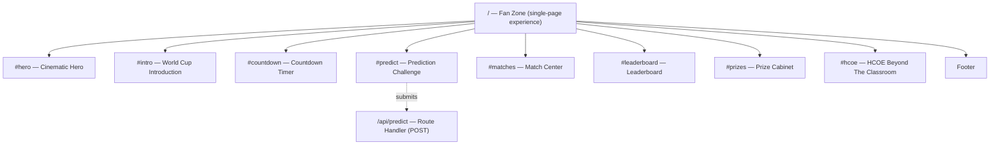
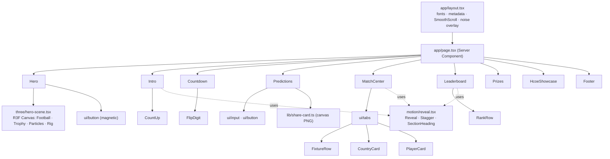
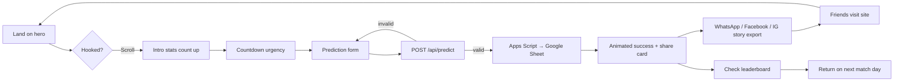
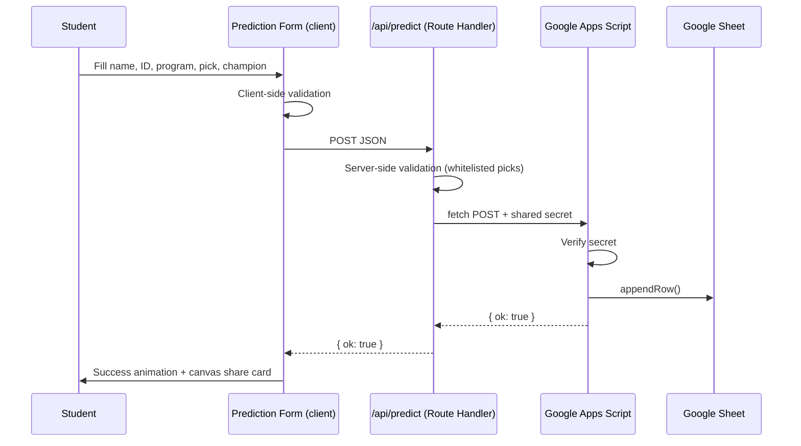
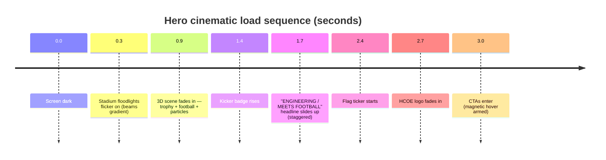

# HCOE World Cup Fan Zone 2026 — Architecture

## Sitemap

## Component Hierarchy

## User Flow

## Prediction Data Flow

## Animation Flow Map

Per-section motion: every section uses `Reveal` (translateY + fade, expo-out ease) and
`Stagger`/`StaggerItem` (90ms cascade). Stat bars and rank bars animate width on
viewport entry. Countdown digits flip vertically each second. All motion respects
`prefers-reduced-motion`.

## Design System

| Token | Value | Role |
|---|---|---|
| `--color-pitch` | `#020617` | Page background |
| `--color-midnight` | `#071124` | Surfaces / primary |
| `--color-crimson` | `#D90429` | Secondary / energy |
| `--color-gold` | `#FFD60A` | Accent / CTAs / trophy |
| `--color-turf` | `#00D26A` | Success |
| `--color-frost` | `#E2E8F0` | Text |

Typography: Bebas Neue (display, `.text-display`), Inter (body), Space Grotesk
(numerals, `.text-numeric`). Fluid scale via `clamp()` custom properties
(`--fs-hero` … `--fs-caption`). Surfaces use `.glass` (+ `-gold` / `-crimson`
glow variants); a fixed SVG-turbulence `.noise` overlay gives broadcast grain.

## Tech Notes

- Next.js 16 App Router; `app/page.tsx` is a Server Component, sections are client islands.
- React Three Fiber canvas is `next/dynamic` (`ssr: false`) so Three.js never blocks first paint; DPR capped at 1.75, fog culls distant particles.
- Lenis smooth scroll wraps the page from the root layout.
- shadcn-style primitives (button/card/input/tabs) hand-rolled with `cva` + `tailwind-merge` to keep the bundle lean — no Radix runtime needed for this page.
